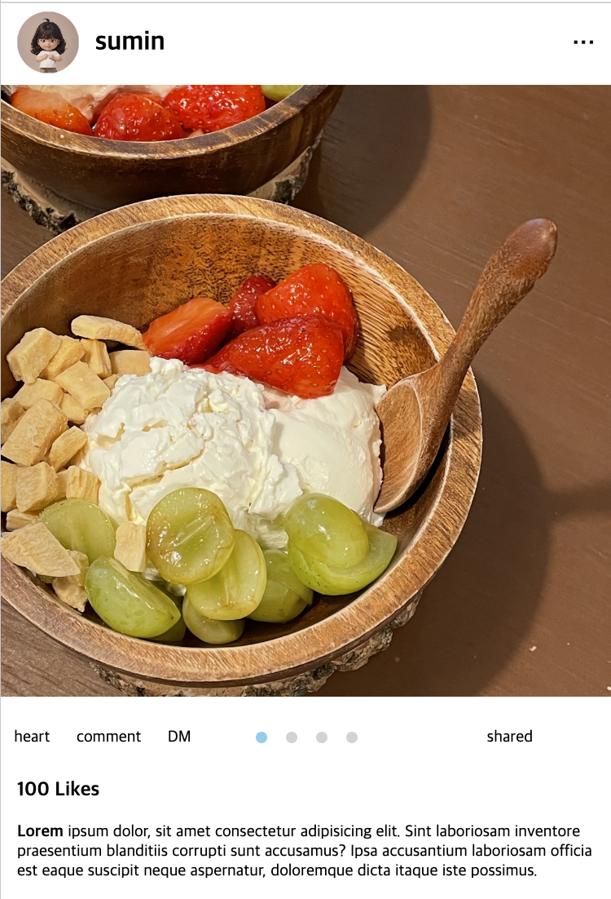

# Instagram Layout

인스타그램 레이아웃 중 Feed Post의 일부분을 디자인 가이드 요구사항에 맞게 마크업 작업한 결과물입니다.

### 🎨 Design guide

[Figma - Instagram UI Kit 1.0](<https://www.figma.com/file/yABsGJOOnqdhEFx7cceyRx/Instagram-UI-Kit-1.0-(Community)?type=design&node-id=2162%3A6021&mode=design&t=rVcp8nanmv2EcChh-1>)

### 🖥️ 화면 샘플

### 🔨 Tech

